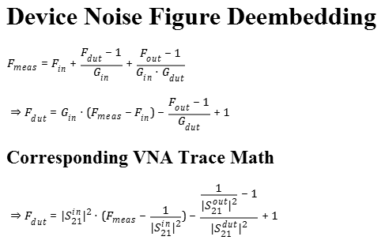

# Noise Figure Deembedding

Python tools for deembedding the input and output traces or probes from a Rohde & Schwarz VNA noise figure measurement.

## Setup

## Derivation from Theory

If we know the loss at the input and output, and we can accurately measure the gain of the device (using S-Parameter deembedding) we can calculate Fdut from Fmeas, the noise figure measurement of the entire chain.

## References

### Theory

- [Noise Figure of Passive Devices](http://www.ittc.ku.edu/~jstiles/622/handouts/Noise%20Figure%20of%20Passive%20Devices.pdf)  
[http://www.ittc.ku.edu/~jstiles/622/handouts/Noise%20Figure%20of%20Passive%20Devices.pdf](http://www.ittc.ku.edu/~jstiles/622/handouts/Noise%20Figure%20of%20Passive%20Devices.pdf)

- [Wikipedia: Noise factor of cascaded devices](https://en.wikipedia.org/wiki/Noise_figure#Noise_factor_of_cascaded_devices)  
[https://en.wikipedia.org/wiki/Noise_figure#Noise_factor_of_cascaded_devices](https://en.wikipedia.org/wiki/Noise_figure#Noise_factor_of_cascaded_devices)

### Schematic

- [Digi-Key Scheme-it](https://www.digikey.com/schemeit/project/noise-figure-deembedding-G1059N0401HG/)

### LaTeX, MathML

- [LaTeX Base Online Compiler](https://latexbase.com/d/852a3d8b-a8d2-44de-a087-f7ca12394184)  
[https://latexbase.com/d/852a3d8b-a8d2-44de-a087-f7ca12394184](https://latexbase.com/d/852a3d8b-a8d2-44de-a087-f7ca12394184)

- [texmath LaTeX to MathML (html) converter](http://johnmacfarlane.net/texmath.html)  
[http://johnmacfarlane.net/texmath.html](http://johnmacfarlane.net/texmath.html)

- [HTML to (transparent) Image Converter](http://www.hiqpdf.com/demo/ConvertHtmlToImage.aspx)  
[http://www.hiqpdf.com/demo/ConvertHtmlToImage.aspx](http://www.hiqpdf.com/demo/ConvertHtmlToImage.aspx)
